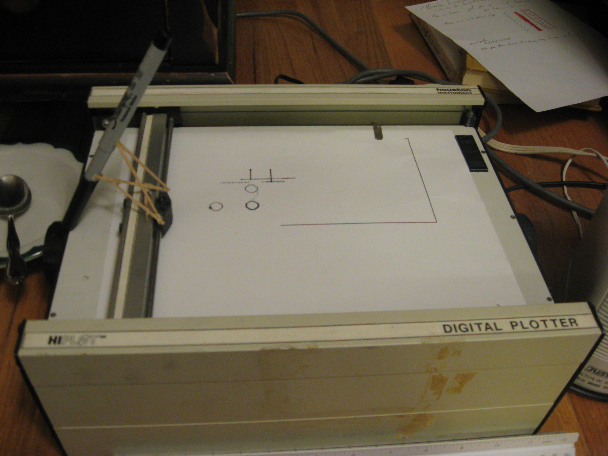
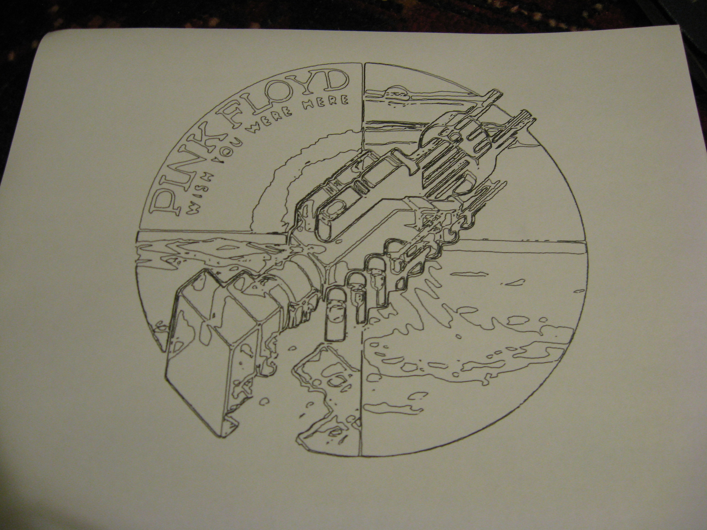

hi-plotter
==========

A serial interface to Huston Instruments DMP-2 pen plotter written in python.

I wrote this as a freshman in highschool, so it probably sucks.

The workflow I had was basically just import a bitmap into inkscape, trace it, and then export it as a .hpgl file. Then I used this program to tranform it into ascii characters which formed the commands which I sent over serial (4800 7N2) using puTTY or minicom or something. Bare in mind, it's been around 6 years since I last ran this thing so this stuff may be wrong.

I'll likely never add the TODO features (Direct serial interfacing and direct SVG transformation) unless I ever have a good reason to or I'm bored.

Hopefully somebody will find this useful.

